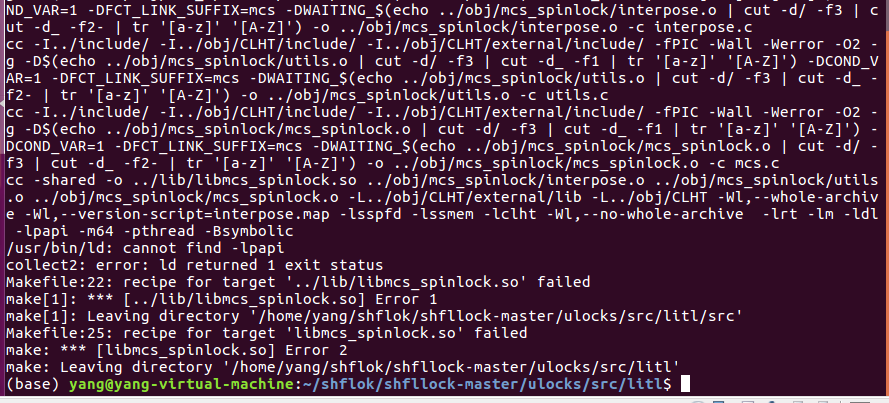
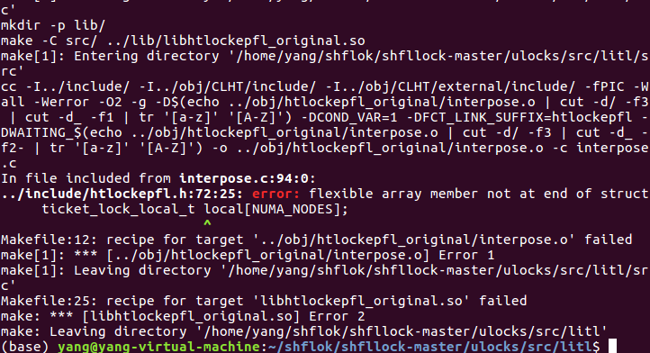
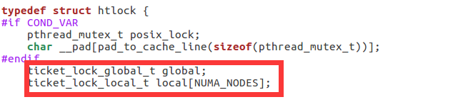
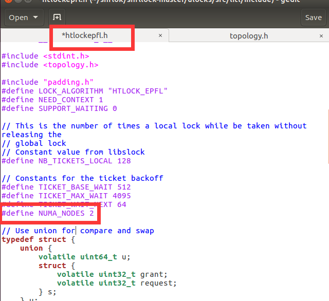
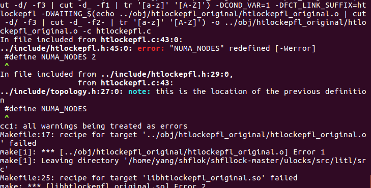
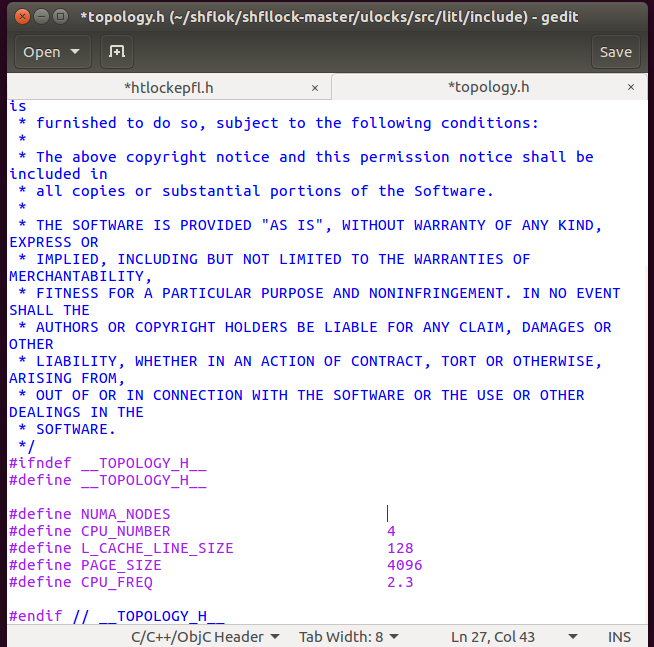
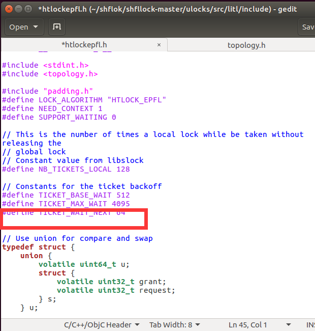
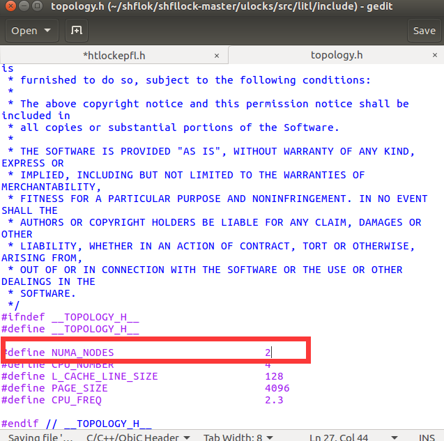
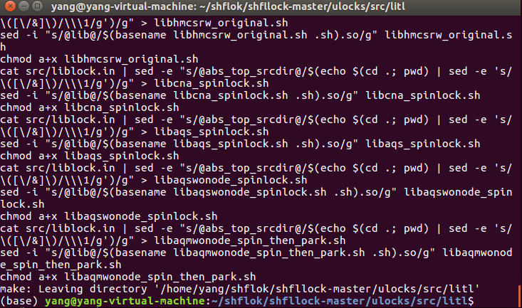

### LIT1 User Space安装

### 编译部分

进入`ulocks/src/litl/`目录。

使用`make -C`命令编译，报错：找不到-lpapi：

```shell
/usr/bin/ld: cannot find -lpapi
collect2: error: ld returned 1 exit status
Makefile:22: recipe for target '../lib/libmcs_spinlock.so' failed
make[1]: *** [../lib/libmcs_spinlock.so] Error 1
make[1]: Leaving directory '/home/yang/shflok/shfllock-master/ulocks/src/litl/src'
Makefile:25: recipe for target 'libmcs_spinlock.so' failed
make: *** [libmcs_spinlock.so] Error 2
make: Leaving directory '/home/yang/shflok/shfllock-master/ulocks/src/litl'

```



查阅资料得知，papi库是一个用于测试性能的工具，我们需要先安装papi工具，使用sudo apt安装命令如下：

```shell
sudo apt-get update
sudo apt-get install libpapi-dev
```

安装成功后再次cmake，可以看到上一次的错误果然不见了，换了另外的**error**:



```shell
../include/htlockepfl.h:72:25: error: flexible array member not at end of struct
     ticket_lock_local_t local[NUMA_NODES];
                         ^
Makefile:12: recipe for target '../obj/htlockepfl_original/interpose.o' failed
make[1]: *** [../obj/htlockepfl_original/interpose.o] Error 1
make[1]: Leaving directory '/home/yang/shflok/shfllock-master/ulocks/src/litl/src'
Makefile:25: recipe for target 'libhtlockepfl_original.so' failed
make: *** [libhtlockepfl_original.so] Error 2
```

这个柔性数组不再结构体的最后面？一个直接的想法就是进去把这个数组移到最后面不就行了？说干就干，在当前目录下的/include找到那个文件，把数组改到最后一行：



重新make一下，发现原来的错误解决了，又来了新的错误：


出现`NUMA_NODES`的地方都出错了，说明这个变量可能没有定义。emmmm，那就我帮他定义一下吧，我又进去代码里面，帮作者定义了一个`NUMA_NODES`



这下再来make一次，果然又报错了，报错的地方又是`NUMA_NODES`,这个变量redefined了。好家伙，这个变量到底定义了没有呀，前面又说找不到，现在又说重复定义。



仔细看报错信息，发现在/include/topologh.y的第27行已经定义过了，于是，我就进去看看，到底是怎么回事。



一看，原来如此，NUMA_NODES被定义为空串，这怎么能行呢，怪不得一直报错，我这里就自作主张，给他定义为2。当然，之前在htlockepfl.h中自己添加的NUMA_NODES就要删掉了。





再来make一次，嘻嘻，终于成功啦。



这些新生成的sh文件，应该就是编译的结果吧。


### 测试部分

根据readme中的信息，我们可以用`./xxxxxxx.sh myprogram`的方式运行生成的锁，


解下来，就可以测试锁啦，我从网上随便复制了一段锁测试代码。

```c++
#include <stdio.h>

#include <pthread.h>

pthread_mutex_t thread_mutex;

int global_val = 0;

void *thread1(void *arg){

while(1){

pthread_mutex_lock(&thread_mutex);

global_val = global_val + 1;

printf("thread1 global_val=%d\n", global_val);

global_val = global_val + 1;

usleep(100);

                printf("thread1 global_val=%d\n", global_val);

usleep(100);

pthread_mutex_unlock(&thread_mutex);

}

return NULL;

}

void *thread2(void *arg){

while(1){

pthread_mutex_lock(&thread_mutex);

        global_val = global_val + 1;

        printf("thread2 global_val=%d\n", global_val);

                usleep(100);

global_val = global_val + 1;

                printf("thread2 global_val=%d\n", global_val);

        usleep(100);

pthread_mutex_unlock(&thread_mutex);

}

return NULL;

}

int main(void){

pthread_t thread_id1 = 0, thread_id2 = 0;

pthread_mutex_init(&thread_mutex, NULL);

pthread_create(&thread_id1, NULL, thread1, NULL);

pthread_create(&thread_id2, NULL, thread2, NULL);

pthread_join(thread_id1, NULL);

pthread_join(thread_id2, NULL);

return 0;

}
```

在命令行中编译成可执行文件，然后再使用`./libxxxxx.sh myprogram`，我把上述代码保存在myprogram0.c中，命令如下:

```shell
gcc myprogram0.c -o myprogram0 -lpthread
./libcna_spinlock.sh ./myprogram0
```

然后就能看到满屏的输出了，代码测试成功！


稍微修改一下代码，让他们不要无限输出。

```shell
#include <stdio.h>

#include <pthread.h>

pthread_mutex_t thread_mutex;

int global_val = 0;

void *thread1(void *arg){

while(global_val < 1000000){

pthread_mutex_lock(&thread_mutex);

global_val = global_val + 1;

printf("thread1 global_val=%d\n", global_val);

global_val = global_val + 1;


                printf("thread1 global_val=%d\n", global_val);


pthread_mutex_unlock(&thread_mutex);

}

return NULL;

}

void *thread2(void *arg){

while(global_val < 1000000){

pthread_mutex_lock(&thread_mutex);

        global_val = global_val + 1;

        printf("thread2 global_val=%d\n", global_val);


global_val = global_val + 1;

                printf("thread2 global_val=%d\n", global_val);


pthread_mutex_unlock(&thread_mutex);

}

return NULL;

}

int main(void){

pthread_t thread_id1 = 0, thread_id2 = 0;

pthread_mutex_init(&thread_mutex, NULL);

pthread_create(&thread_id1, NULL, thread1, NULL);

pthread_create(&thread_id2, NULL, thread2, NULL);

pthread_join(thread_id1, NULL);

pthread_join(thread_id2, NULL);

return 0;

}
```

重新编译一下

```shell
gcc myprogram0.c -o myprogram0 -lpthread
```

顺便记录一下运行时间,运行！

```shell
time ./libaqmwonode_spin_then_park.sh ./myprogram0
time ./libalockepfl_original.sh ./myprogram0
```


跑步比赛，现在开始!


比赛结束！


左边锁比右边锁快了2s多。再测试一下？


同样也相差了2s多，在这个测试中，左边锁完胜!

