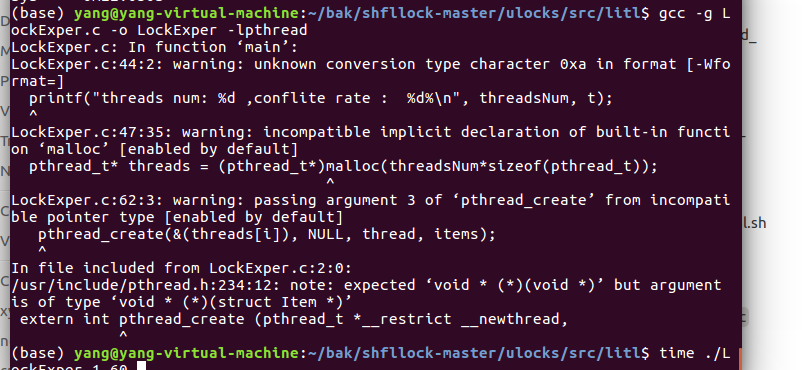
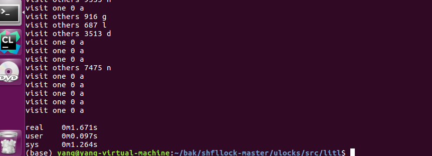

### 代码

在litl新建一个LockExper.c文件，代码（初版）如下：

```c
#include <stdio.h>
#include <pthread.h>
#include <unistd.h>

#define NUM  10000
#define VISIT_TIMES  10000
struct Item
{
	char data[128];
};
int t = 50;
pthread_mutex_t locks[NUM]; // locks, correspond to every array element


void* thread(struct Item *items){
	int i;
	for(i = 0; i < VISIT_TIMES; i++){
	    int r = rand() % 100;
		if(r < t){
			pthread_mutex_lock(&locks[0]);

			printf("visit one %d %c\n", 0, items[0].data[0]);
			pthread_mutex_unlock(&locks[0]);	
		}
		else{
			int cur = rand() % (NUM-1)+1;
			pthread_mutex_lock(&locks[cur]);
			printf("visit others %d %c \n",cur, items[cur].data[0]);
			pthread_mutex_unlock(&locks[cur]);	
		}		
	}

}

int main(int argc, char* argv[])
{
	
	t = atoi(argv[2]);
	int threadsNum = atoi(argv[1]);
	struct Item items[NUM]; // array element
	printf("threads num: %d ,conflite rate :  %d%\n", threadsNum, t);

	// init
	pthread_t* threads = (pthread_t*)malloc(threadsNum*sizeof(pthread_t));


    	srand((unsigned)time(NULL));
	int i;
	for(i = 0; i < NUM; i++)
	{
		pthread_mutex_init(&locks[i],NULL);
		items[i].data[0] = (i%26)+'a';
	}

	// create threads
	for(i = 0; i < threadsNum; i++){
		threads[i] = i+1;
		pthread_create(&(threads[i]), NULL, thread, items);
	}

	for(i = 0; i < threadsNum; i++){
		pthread_join(threads[i], NULL);
	}


	while(wait(NULL)!=-1){sleep(100);}
	//printf("everyone finished");
	return 0;
	
	
}
```

### 代码解释

这部分代码比较简单，这里定义了两个宏变量，NUM表示数组元素，VISIT_TIMES表示每个线程访问次数。按照要求应该是NUM=10E6,VISIT_TIMES=10E8，这里我们可以稍微小一点。

t是默认的冲突率，locks数组是锁的集合，每一个锁对应着items数组的每一个元素。也就是说，在访问items[i]之前，都要先对locks[i]，加锁。

```c++
#define NUM  1000000
#define VISIT_TIMES  1000

int t = 50;
pthread_mutex_t locks[NUM]; // locks, correspond to every array element

```

每个线程做的事情，访问VISIT_TIMES次，每次访问到时候，以t概率访问第0号元素，以1-t概率访问随机元素(第`cur`个)。访问之前要先获得对应位置的锁。访问过后释放。

```c++
void* thread(struct Item *items){
	int i;
	for(i = 0; i < VISIT_TIMES; i++){
	    int r = rand() % 100;
		if(r < t){
			pthread_mutex_lock(&locks[0]);

			printf("visit one %d %c\n", 0, items[0].data[0]);
			pthread_mutex_unlock(&locks[0]);	
		}
		else{
			int cur = rand() % (NUM-1)+1;
			pthread_mutex_lock(&locks[cur]);
			printf("visit others %d %c \n",cur, items[cur].data[0]);
			pthread_mutex_unlock(&locks[cur]);	
		}		
	}

}
```

主函数中，首先接收带的参数t和threadsNum,分别代表了冲突率和线程数量。拿到线程数量threadsNum之后，就用`malloc`定义一个线程数组`threads`。

```c++
	
	t = atoi(argv[2]);
	int threadsNum = atoi(argv[1]);
	struct Item items[NUM]; // array element
	printf("threads num: %d ,conflite rate :  %d%\n", threadsNum, t);

	// init
	pthread_t* threads = (pthread_t*)malloc(threadsNum*sizeof(pthread_t));

    srand((unsigned)time(NULL));
```

下面的代码其实也在做初始化的工作：初始化每一个locks数组的对象，初始化每个items数组的对象。

```c++
for(i = 0; i < NUM; i++)
	{
		pthread_mutex_init(&locks[i],NULL);
		items[i].data[0] = (i%26)+'a';
	}

```

创建线程，使用`phread_create`函数创建并启动线程。

```shell
	// create threads
	for(i = 0; i < threadsNum; i++){
		threads[i] = i+1;
		pthread_create(&threads[i], NULL, thread, items);
	}
```

当所有子线程全部结束之后，主函数也退出。

```c++
	for(i = 0; i < threadsNum; i++){
		pthread_join(threads[i], NULL);
	}


	while(wait(NULL)!=-1){sleep(100);}
	//printf("everyone finished");
	return 0;
	
```

### 编译生成可执行文件

使用gcc编译链接生成可执行文件`LockExper`

```shell
gcc -g LockExper.c -o LockExper -lpthread
```



### 运行比较各种锁

#### 使用linux自带锁

如果使用linux自带的mutex，那么直接`./LockExper`再加上线程数量、冲突概率即可，用time命令记录时间。如下

```shell
time ./LockExper 8 60 # 8个线程 60%冲突概率
```



大概是1.67s

#### 使用LITL中实现的锁

使用比较简单，其实就是再可执行文件之前加上对应的sh脚本即可。比如我们随便挑一个`libspinlockepfl_original.sh `.使用命令如下

```shell
time ./libspinlockepfl_original.sh ./LockExper
```

结果让人非常吃惊，竟然达到了55s


由此可见，不同的锁影响还是特别大的。把shell脚本换成别的锁，就可以测试别的了。