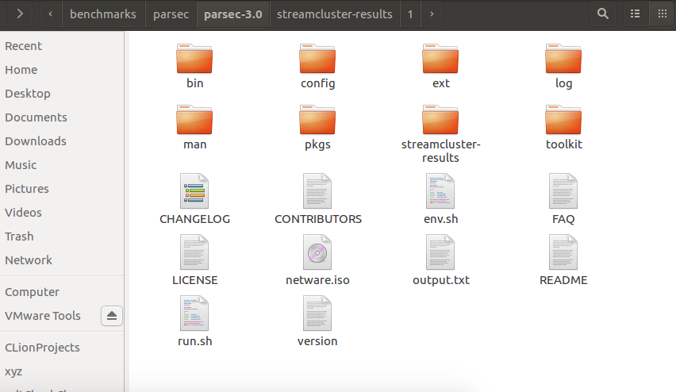
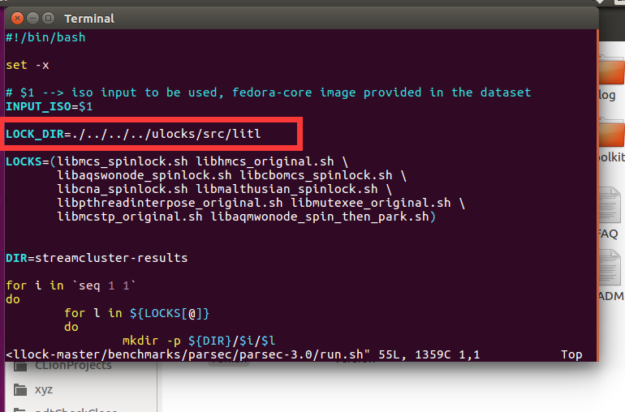
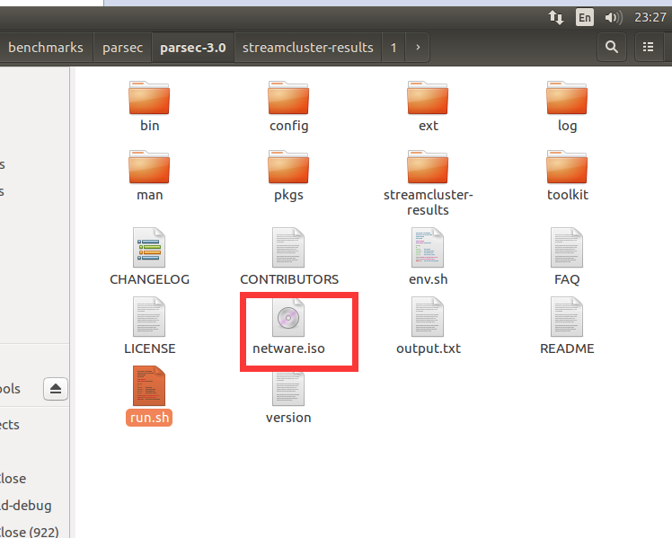
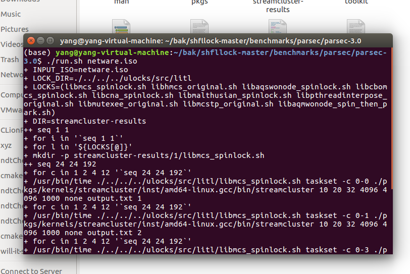
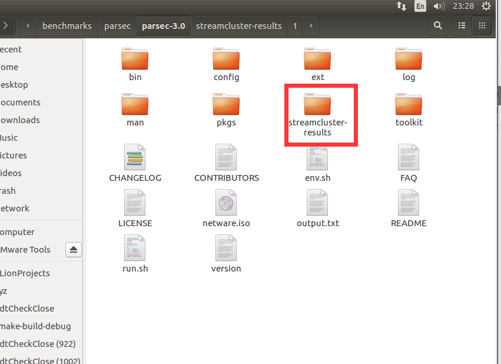
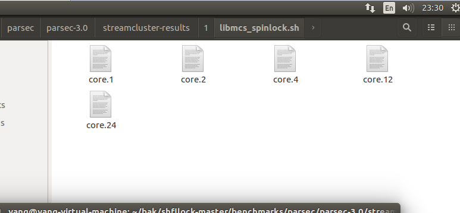
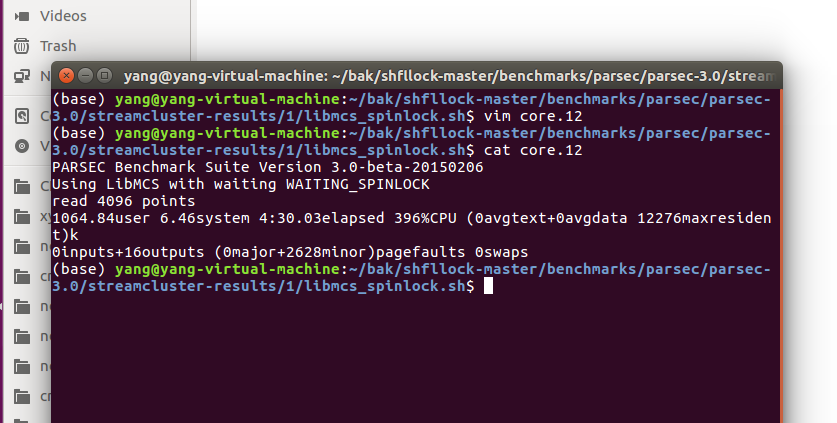

## 使用StreamCluster程序测试锁

### 构建parsec-3.0/streamCluster

参考[网站](https://parsec.cs.princeton.edu/parsec3-doc.htm)上的文档，到[这个网页](http://parsec.cs.princeton.edu/download/3.0/parsec-3.0-core.tar.gz)下载core文档，将`parsec-3.0-core.tar.gz`文件复制到`benchmards/parsec`目录下。

再解压，进入解压后的文件，命令如下：

```shell
tar -xzf parsec-3.0.tar.gz
cd parsec-3.0
```

在`parsec`目录下，设置环境变量

```shell
source env.sh
```

构建`streamCluster`，命令如下：

```shell
parsecmgmt -a build -p streamcluster
```

### 使用streamcluster测试锁

将`parsec/run.sh`复制到`parsec/parsec-3.0`下。



修改`run.sh`的内容，这个`LOCK_DIR`的值，必须是当前litl文件夹相对于run.sh的位置。这里，我们需要改成：

```shell
LOCK_DIR=./../../../ulocks/src/litl
```



保存退出之后将测试iso文件复制到`parsec-3.0`目录下，如图：



在当前目录下调用命令

```shell
./run.sh netware.iso
```



马上可以看到生成了streamcluster-results文件夹



里面就是使用各种锁测试的数据，比如说，`streamcluster-results/1/libmcs_spinlock.sh`目录下如下



分别记录了当前情况下运行所需要的时间：

