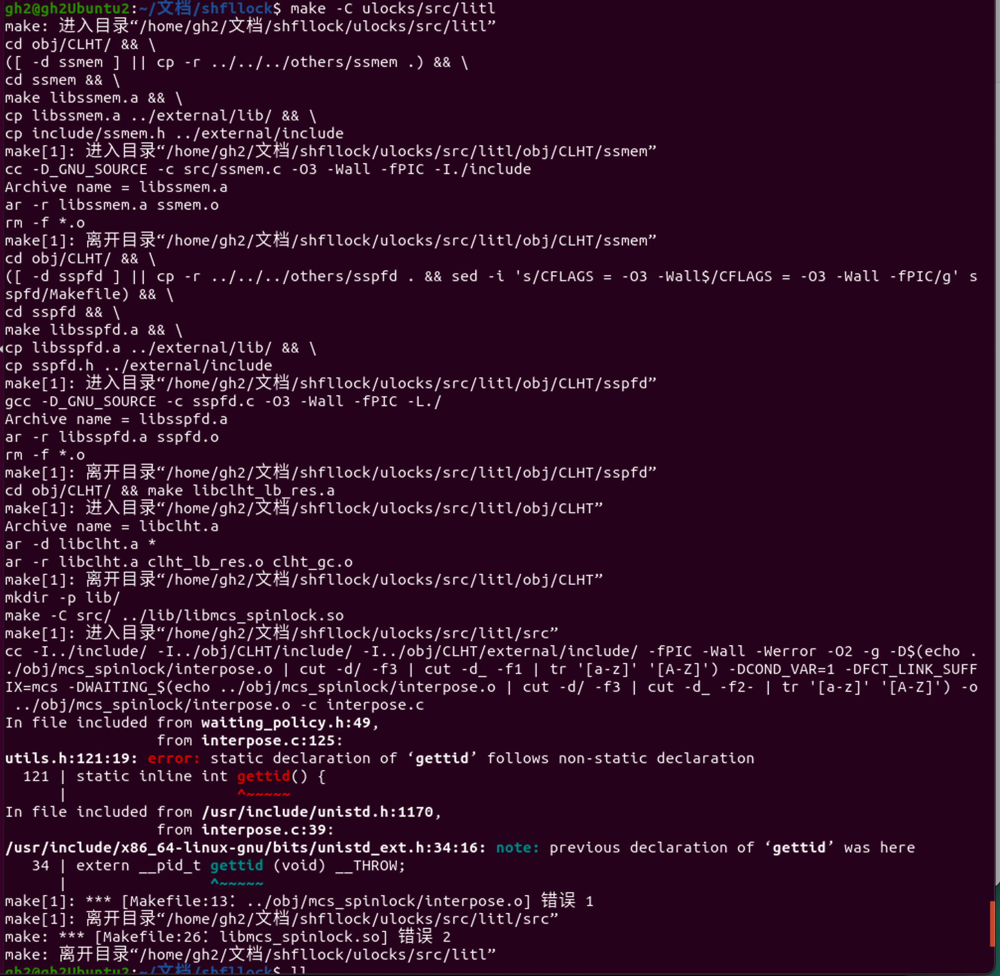
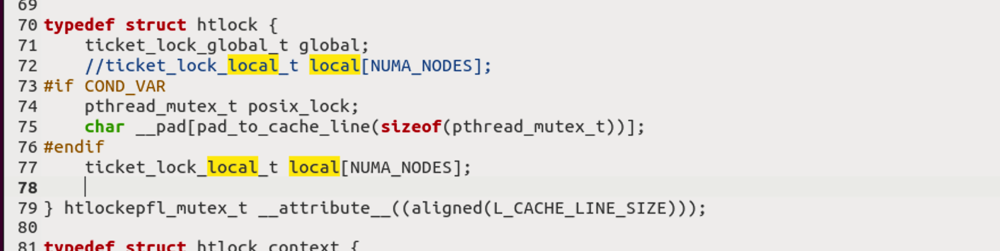

## 问题一：gettid冲突

### 	解决方法一：

​		给LiTL的gittid函数重命名

​		修改的地方：

​			1.utils.h			

修改过后：

## 问题二：

简介

伸缩数组(flexible array)这是C99对结构体功能的扩展.可伸缩性的体现在于,在结构体的原型声明时,可以声明一个没有指定数组长度的数组,在使用时通过malloc动态决定结构体变量的数组大小.

规则

---伸缩数据必须是结构体的最后一个成员

编译报错:"error: flexible array member not at end of struct"	

#### 解决方法一：

将改语句移到结构体最后

修改前：

修改后：(此方法不成功)

#### 解决方法二